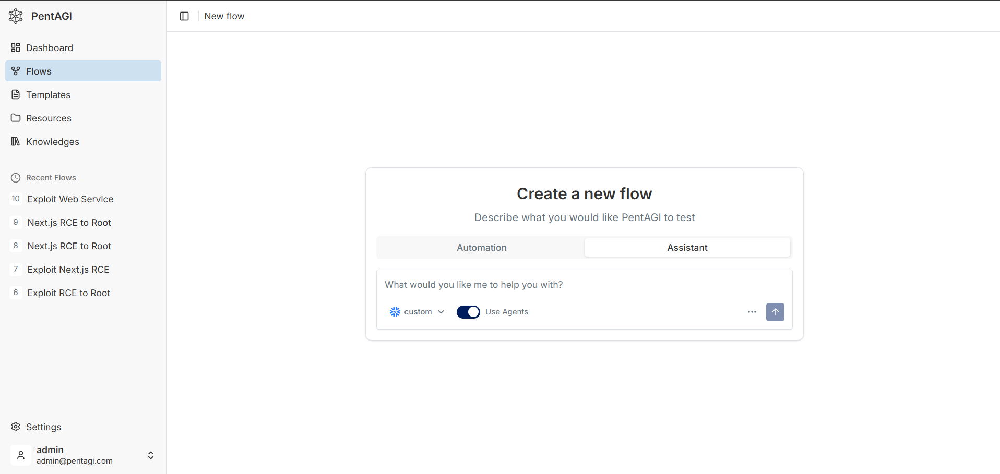

# 02 — PentAGI Red Team Setup

## Objective

Configure PentAGI as an authorized red-team/pentest simulator. It produces telemetry and alerts for the lab; it does not investigate Sentinel data or replace the Foundry Investigation Agent.

## Start the stack

```powershell
cd D:\SOC-Lab\pentagi
docker compose up -d
docker compose ps
docker compose logs -f pentagi
```

Open the Compose web URL (normally `https://localhost:8443` for the current configuration), sign in, then test the provider under **Settings → Providers**. Before starting an engagement, validate the chat provider and embeddings from the container when the configuration has changed:

```powershell
docker exec -it pentagi /opt/pentagi/bin/ctester -verbose
docker exec -it pentagi /opt/pentagi/bin/etester test -verbose
```

## Current `.env` configuration

Secrets are intentionally redacted. The current deployment uses a custom Azure OpenAI-compatible endpoint:

```dotenv
DEBUG=false
PENTAGI_LISTEN_IP=127.0.0.1
PENTAGI_LISTEN_PORT=8443
PUBLIC_URL=https://localhost:8443
CORS_ORIGINS=https://localhost:8443
COOKIE_SIGNING_SALT=<set>

LLM_SERVER_URL=https://lab-project-001.openai.azure.com/openai/v1
LLM_SERVER_KEY=<set>
LLM_SERVER_MODEL=fw-glm-5.2
LLM_SERVER_PROVIDER=
LLM_SERVER_CONFIG_PATH=
LLM_SERVER_LEGACY_REASONING=false
LLM_SERVER_PRESERVE_REASONING=false

EMBEDDING_PROVIDER=openai
EMBEDDING_URL=https://lab-project-001.openai.azure.com/openai/v1
EMBEDDING_KEY=<set>
EMBEDDING_MODEL=text-embedding-3-small
EMBEDDING_BATCH_SIZE=100
EMBEDDING_STRIP_NEW_LINES=true
EMBEDDING_MAX_TEXT_BYTES=8192

DUCKDUCKGO_ENABLED=true
GRAPHITI_ENABLED=false
DOCKER_INSIDE=false
```

The only current API keys required by PentAGI are `LLM_SERVER_KEY` and `EMBEDDING_KEY`. DuckDuckGo is enabled without a key. Graphiti, Langfuse, OAuth, and Docker-in-Docker are not configured.

After changing `.env`:

```powershell
docker compose config
docker compose up -d
docker compose logs -f pentagi
```

## Modes

| Mode | Purpose | Use it when |
|---|---|---|
| **Automation** | PentAGI plans, delegates, and executes a defined assessment objective end-to-end as a Flow. | The target, scope, rules of engagement (ROE), allowed actions, and success criteria are already approved. |
| **Assistant** | An interactive control channel for an existing engagement: clarify constraints, redirect priority, inspect output, stop the flow, or answer an automation checkpoint. **Use Agents** controls whether it delegates specialised subtasks. | Operator intervention is required during a flow; it is not a prerequisite for Automation. |

> **Lab recommendation:** use **Automation** when the target and ROE are explicitly approved. Put the boundaries in the initial prompt so the autonomous flow is bounded from its first action. Use Assistant only to steer, pause, or clarify the current flow. Run PentAGI only against systems you own or are explicitly authorized to assess.

## Automation workflow

1. Open **Flows → New Flow**.
2. Select **Automation** and a provider/model that passed `ctester`.
3. State the authorized target, assessment objective, explicit in-scope and out-of-scope boundaries, allowed actions, prohibited actions, and success criteria.
4. Submit the flow. Review the **Flow** page for tasks, subtasks, logs, tool activity, files, and status.
5. Use **Assistant** only when the operator needs to add a constraint, redirect the current flow, submit information requested by the flow, or stop it.
6. Review the report and evidence before downloading the Markdown or PDF report.

### Minimum engagement prompt

```text
Assess <AUTHORIZED_TARGET> for <APPROVED_OBJECTIVE>.

Scope: only <IN_SCOPE_HOSTS_OR_URLS>.
Do not test any other host or service. Do not modify production data, create persistence, or retain credentials.
Stop and report if the target is out of scope or an action requires additional approval.

Return confirmed findings with evidence, impact, and remediation guidance.
```

PentAGI is an autonomous penetration-testing platform, not a predefined BAS/adversary-emulation product. Treat every run as a scoped assessment and do not assume it supplies a prebuilt attack campaign.

## Operational controls worth knowing

- **Templates:** save a repeatable approved assessment prompt, then adjust the target and boundaries before every run.
- **Flow view:** follow messages, task/subtask status, agent activity, tool output, files, and completion state. This is the primary place to review an Automation run.
- **Assistant view:** it can read flow status, submit follow-up input, patch remaining subtasks, or stop the flow. It is a visible operator-control path for the same flow, not an invisible background queue.
- **Files and evidence:** uploads and attached resources are scoped to one flow. Agent containers receive uploads under `/work/uploads/` and attached resources under `/work/resources/`; pull any required evidence into the flow before the container ends.
- **Reports:** review the result in the web view before exporting Markdown or PDF.
- **Optional supervision:** `EXECUTION_MONITOR_ENABLED` and `AGENT_PLANNING_STEP_ENABLED` are disabled in the current configuration. They can reduce loops and improve decomposition for weaker/smaller models, but increase runtime and token consumption. Enable and test them deliberately; they do not replace ROE or operator review.

The New Flow screen below shows both modes and the **Use Agents** toggle. The screenshot has Assistant selected, but the lab guidance above selects **Automation** for an approved engagement.


