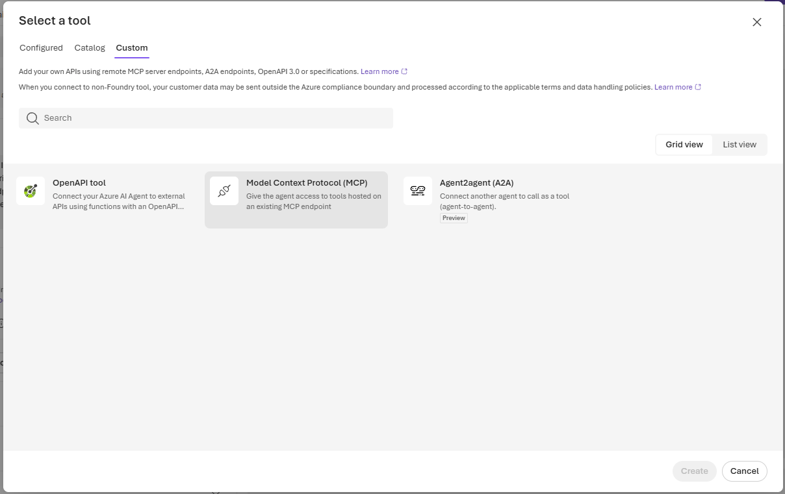
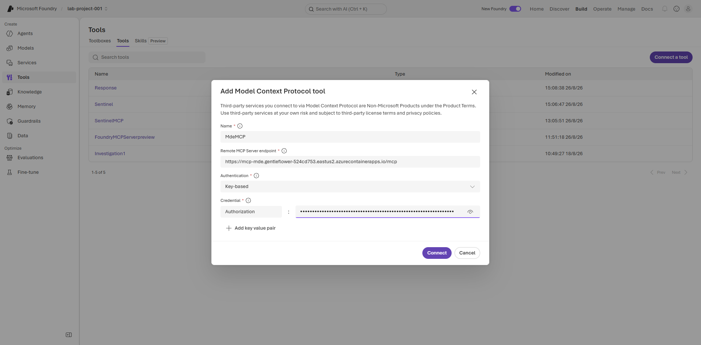
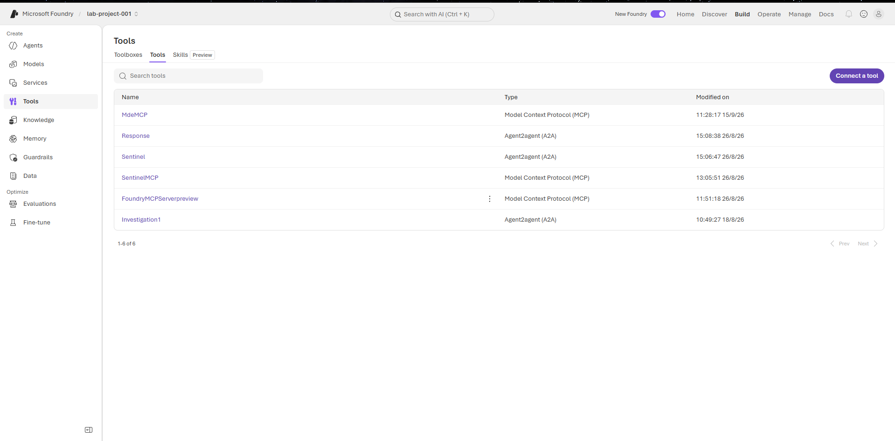

# 03 — Connect SentinelMCP and MdeMCP

## Objective

Attach the two existing MCP servers to the Foundry project without exposing secrets.

## Endpoints

```text
SentinelMCP: https://mcp-sentinel.gentleflower-524cd753.eastus2.azurecontainerapps.io/mcp
MdeMCP:      https://mcp-mde.gentleflower-524cd753.eastus2.azurecontainerapps.io/mcp
```

The MCP servers expect bearer authentication:

```text
Authorization: Bearer <MCP_API_KEY>
```

Get `MCP_API_KEY` from the relevant MCP secret configuration, never from an Azure OpenAI model key. The source is either the matching local `.env` file or the Container App environment/secret reference. Do not paste the value into chat, prompts, or screenshots.

## Foundry UI steps

1. Open Azure AI Foundry and select `lab-project-001`.
2. Open **Build → Agents**, then open or create the Investigation Agent.
3. Under **Tools**, select **Add → Model Context Protocol (MCP)**.
4. Add `SentinelMCP` with the Sentinel endpoint and bearer credential.
5. Add `MdeMCP` with the MDE endpoint and bearer credential.
6. Save, reconnect/refresh each connection, and confirm tool discovery succeeds.

Choose **Model Context Protocol (MCP)** from the Custom tool catalog:



Use the following connection shape for MdeMCP: the endpoint ends with `/mcp`, authentication is **Key-based**, the credential name is `Authorization`, and the secret value is a bearer token. The value is masked in the image and must remain masked in documentation.



After connection, verify the project **Tools** list contains both `SentinelMCP` and `MdeMCP` as **Model Context Protocol (MCP)** tools:



## Expected tool categories

| MCP | Expected investigation tools |
|---|---|
| SentinelMCP | Workspace discovery, table/schema discovery, KQL query, alert/incident lookup. |
| MdeMCP | Machine inventory, machine details, related alerts, endpoint telemetry lookup. |

## Validation

- Connection state must not show `401`, `403`, or `tools/list failed`.
- If a key changed, update both the Container App secret and the Foundry connection, then reconnect.
- Test the Investigation Agent directly before wiring it through any Orchestrator/A2A flow.
