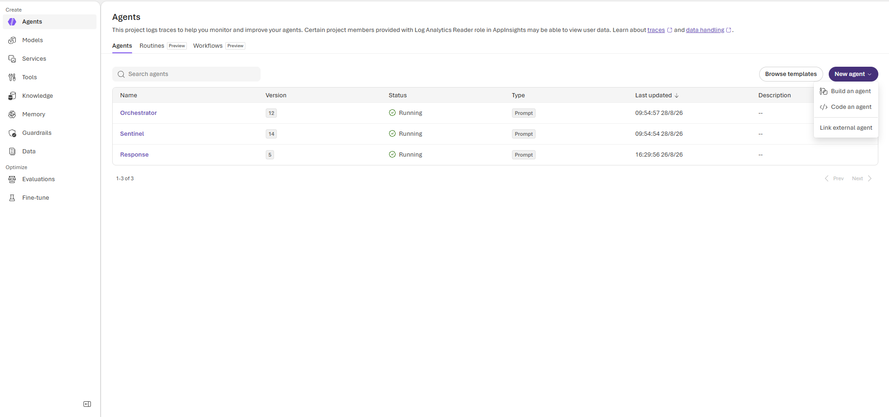
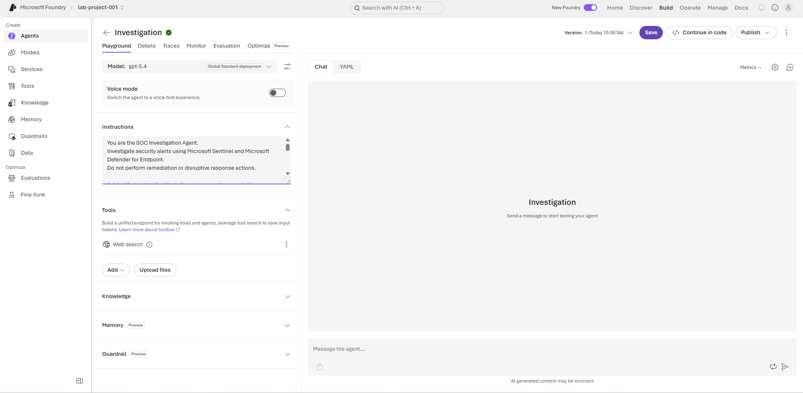
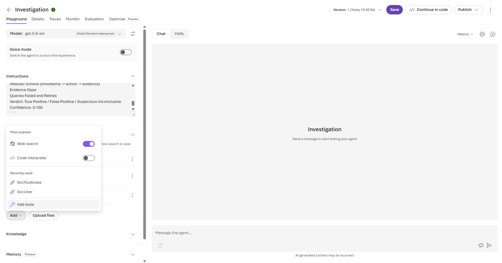
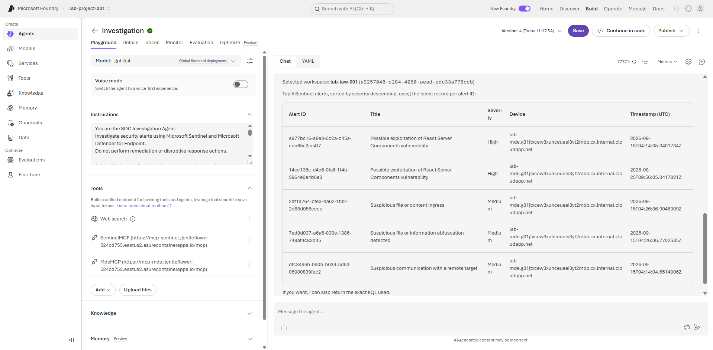

# 04 — Create the Investigation Agent

## Objective

Create a read-only Foundry agent that collects evidence from Sentinel and MDE, retries recoverable query errors, and produces an evidence-based timeline.

## UI steps

1. In `lab-project-001`, open **Build → Agents → New agent**.
2. Name the agent `Investigation`.
3. Choose the available model deployment, for example `gpt-5.4`.
4. Attach `SentinelMCP` and `MdeMCP` from module 03.
5. Paste the instructions below.
6. Save and **Publish** a new version.
7. Test the published version in **Chat**.

The Agents page shows the existing Foundry agents and the **New agent** menu:



## Instructions

```text
You are the SOC Investigation Agent.
Investigate security alerts using Microsoft Sentinel and Microsoft Defender for Endpoint.
Do not perform remediation or disruptive response actions.

1. Identify the alert/incident, timestamp, workspace, device, account, and severity.
2. Call list_workspaces first and explicitly select the workspace associated with the alert.
3. Retrieve schemas before writing queries. Never assume a column exists.
4. Use small bounded queries: a narrow time window and take/top 20-100.
5. Correlate process ancestry, command lines, files, hashes, network activity, persistence, and related alerts.
6. Query before and after the alert and reconstruct a chronological timeline.
7. If a query fails, inspect the error, correct or simplify it, retry once, then try another table/source. Do not stop after one failed query.
8. Return partial evidence and clearly label evidence gaps. Never invent telemetry.

Return:
Summary
Root Cause
Attacker Actions (timestamp -> action -> evidence)
Evidence Gaps
Queries Failed and Retries
Verdict: True Positive / False Positive / Suspicious-Inconclusive
Confidence: 0-100
```

## Test prompts

```text
List 5 Sentinel alerts in workspace lab-law-001 sorted by severity descending. Return alert ID, title, severity, device, and timestamp.
```

```text
Deeply investigate alert <ALERT_ID>. Retrieve schemas first, correlate Sentinel and MDE telemetry, retry failed queries, and return a timestamped attacker timeline. Do not remediate.
```

The agent editor should show the model, instructions, and the Tools panel before publishing:



Use **Add** in the Tools section to attach already configured tools/toolboxes. The menu below illustrates where the existing tool connections appear.



This successful chat test shows the agent returning a bounded, severity-sorted Sentinel alert list while both MCP tools are attached:



## Acceptance criteria

- The trace starts by choosing a workspace.
- The agent retrieves schema before referencing unknown columns.
- Failed KQL is corrected/retried rather than ending the run.
- The final answer separates confirmed evidence from hypotheses.
- No response action is called.
