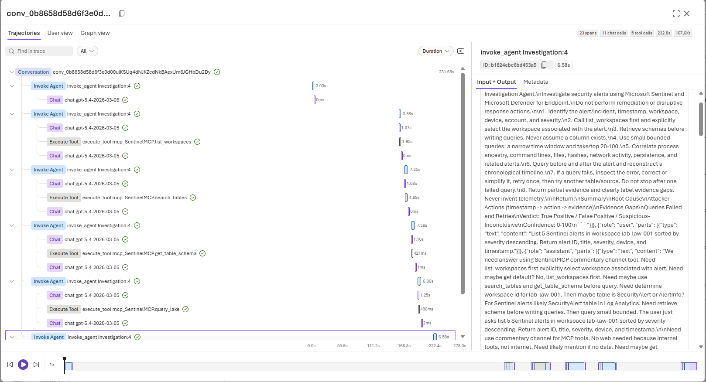

# 05 — Traces and Troubleshooting

## Inspect a run

1. Submit a prompt in the agent **Chat** tab.
2. Open **Traces** on the run result.
3. In **Trajectories**, inspect tool-call order.
4. Open every `Execute Tool` event and review **Input + Output**.
5. Use **Graph view** to see agent → MCP → tool relationships.

The trace below shows the expected pattern: an Investigation Agent invocation expands into bounded Sentinel MCP calls such as `list_workspaces`, `search_tables`, `get_table_schema`, and `query_lake`. Select an event to inspect its tool arguments and result in the right-hand pane.

Check the following:

- Correct workspace ID and hostname/machine ID.
- Schema retrieved before querying uncertain columns.
- Time window includes the alert timestamp.
- KQL uses bounded results (`take`/`top`).
- A query failure is retried or replaced with an alternative source.

## Common investigation failures

| Error | Meaning | Recovery |
|---|---|---|
| `HTTP 401 invalid_token` | Stale/wrong MCP credential. | Update the MCP key in the Foundry connection and reconnect. |
| `tools/list failed` | MCP endpoint, startup, or authentication problem. | Check Container App health/logs and verify the `/mcp` URL. |
| `Table not found in workspace metadata` | Metadata discovery missed the table or wrong workspace was selected. | Select the workspace explicitly; retrieve schema or issue a small direct query. |
| `400 KQL semantic error` | Invalid column/table/syntax. | Retrieve schema, simplify the query, then retry. |
| `network error` / timeout | Query too broad or service is unavailable. | Reduce time window, add `take`, run fewer queries, then check MCP logs. |
| Agent stops after one error | Instructions do not require recovery or tool error was terminal. | Use the instruction recovery rule; preserve partial evidence and continue with another source. |

## Quality bar

The run is complete only when it identifies the alert context, uses evidence from Sentinel/MDE, includes a chronological timeline, documents evidence gaps, and does not state unverified assumptions as fact.
